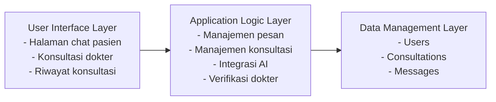
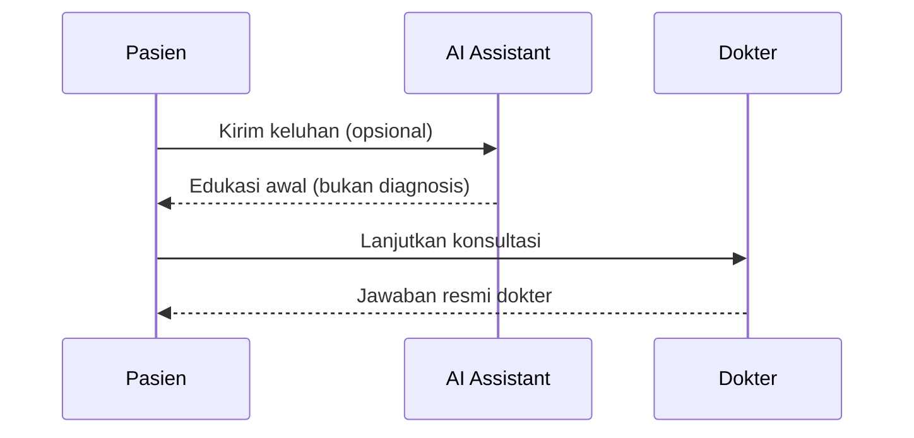
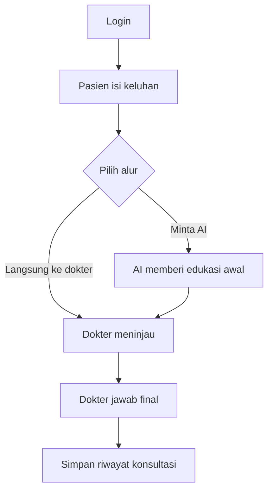
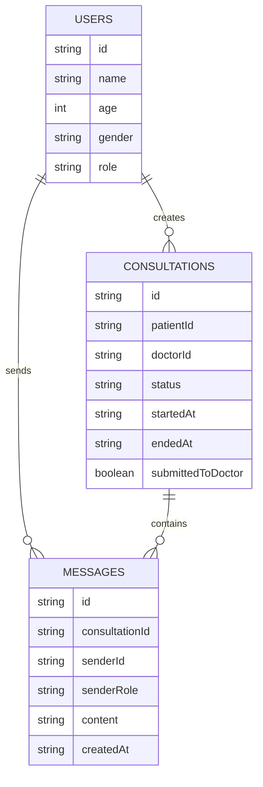

# Model Sistem

## Model Konseptual (Tiga Lapisan)

## Model Interaksi AI (Opsional)

## Model Alur Proses (Sederhana)

## Model Data (Ringkas)

Catatan: respons AI direpresentasikan sebagai `MESSAGES.senderRole = 'ai'`.
